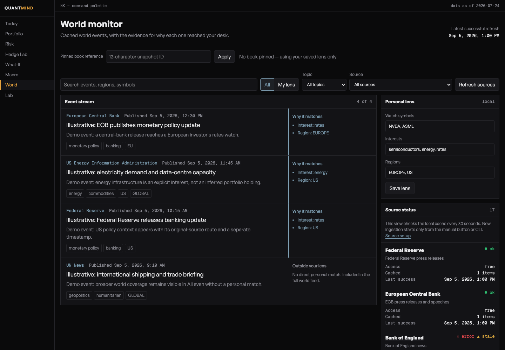
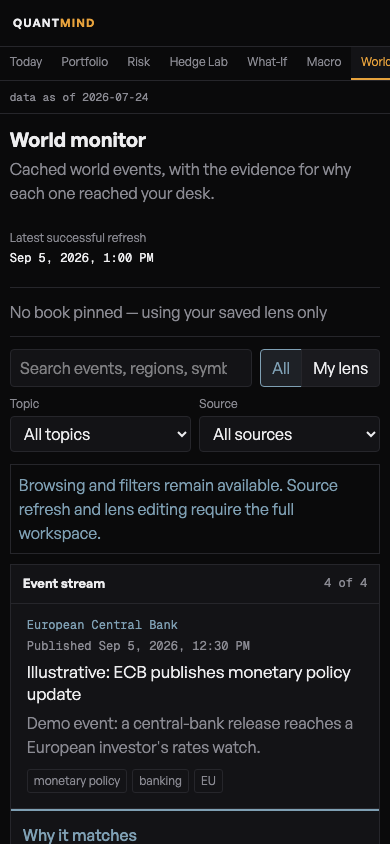

# QuantMind

A personal portfolio and risk workbench: understand what you own, explore what drives its risk, and follow the world events that matter to you.

QuantMind runs on your computer. It combines a read-only IBKR connection, a local evidence cache, analytical tools, and a personal **World** news desk. It is built for one investor and one selected account at a time.

[Get started](#get-started) · [Find your way around](#find-your-way-around) · [World monitor](#make-world-your-own) · [User guide](docs/USER_GUIDE.md) · [Release notes](CHANGELOG.md)

<a href="docs/screenshots/world-desktop.png"></a>

*World on desktop. Headlines and watchlists shown here are illustrative fixtures, not live news or a real portfolio. Click any screenshot to open it at full size.*

> [!IMPORTANT]
> **Research software, not a trading system.** QuantMind is a pre-1.0 alpha. It never submits orders, and its outputs are not investment advice. Check the inputs, assumptions, and limitations before using a result.

## What you can do

- **Understand your positions:** inspect stocks, ETFs, and equity options, including contract identity, currencies, valuation, and delta-adjusted exposure.
- **Study a holding's risk:** fit factor regressions, inspect beta and uncertainty, and explore historical tail loss and simulations.
- **Compare equity-book decisions:** test weight changes or explore hedge sizing against a target beta, without placing a trade.
- **Build a personal World desk:** follow public macro, central-bank, energy, and world-event feeds through your holdings, watchlist, topics, and regions.
- **Keep evidence visible:** see where data came from, how old it is, and why a calculation is unavailable.

**Know the scope:** Risk currently analyses **one symbol**, not the whole book's factor contributions. What-If and Hedge Lab currently require an equity-only book. European listings, dated FX conversion, and optional justETF profiles are supported; issuer-holdings look-through is still future work.

## Get started

You need **Python 3.12+**, [uv](https://docs.astral.sh/uv/), and [Bun](https://bun.sh/). Start with the demo if you want to learn the interface before connecting an account.

### 1. Install

```bash
git clone https://github.com/ionutnodis/quant-mind.git
cd quant-mind
uv sync --locked --dev
cd web
bun install --frozen-lockfile
bun run build
cd ..
```

### 2. Choose demo or your own portfolio

**Try the demo — no broker or API keys needed**

From the repository root:

```bash
uv run python -m quantmind.testing.synthetic_e2e --port 8765
```

In a second terminal, from the repository root:

```bash
cd web
QM_API_PROXY_TARGET=http://127.0.0.1:8765 bun run dev -- --port 4173
```

Open **[127.0.0.1:4173](http://127.0.0.1:4173)**. The dashboard uses a temporary synthetic dataset, isolated from your real holdings. It is for learning and testing, not live prices or broker validation. World starts empty in this demo; [the illustrated World demo](docs/USER_GUIDE.md#try-the-illustrated-world-demo) includes sample events.

**Use your own portfolio**

```bash
cp .env.example .env
```

Edit `.env` to select your IBKR account, connection, and reporting currency:

```dotenv
QM_ACCOUNT_ID=YOUR_ACCOUNT_ID
QM_HOST=127.0.0.1
QM_PORT=4002
QM_BASE_CURRENCY=EUR
```

Start **IB Gateway or TWS with read-only API access**, then run:

```bash
uv run python -m quantmind.api.main
```

Open **[Setup](http://127.0.0.1:8000/book/setup)** and follow its **Next action**. Port `4002` is the usual paper IB Gateway port; check your own connection settings. Use the [first-user runbook](docs/FIRST_USER_RUNBOOK.md) for broker configuration and the acceptance checklist.

> Keep `.env`, account IDs, API tokens, and your `data/` directory private. The default server is local-only; this is not a hosted multi-user service.

### 3. Get to your first useful result

1. **Sync in Setup.** Download the prices, contracts, FX, and other evidence the selected book needs. Resolve any named warnings.
2. **Pin your book.** Save a snapshot of the selected account's positions. A pinned reference keeps those positions fixed while you compare results.
3. **Check Portfolio against IBKR.** Verify quantities, listings, currencies, option contracts, and valuation before trusting the analysis.
4. **Explore.** Use Risk for a single holding, World for relevant events, or What-If and Hedge Lab for an equity-only book.

**Sync refreshes data; pin saves positions.** After a broker-side portfolio change, sync as needed and pin a new book. A dash means unavailable, not zero. [Learn the terminology and evidence rules →](docs/USER_GUIDE.md#start-here-the-quantmind-mental-model)

## Find your way around

| Screen | Start here when you want to… |
| --- | --- |
| **Setup** | Connect, refresh missing data, resolve warnings, or pin a book. |
| **Today** | Scan market regime, overnight moves, and benchmark context. |
| **Portfolio** | Reconcile holdings and inspect valuation and option exposure. |
| **Risk** | Understand the factors and tail risk of **one selected symbol**. |
| **What-If** | Compare a proposed **equity-book** weight change. |
| **Hedge Lab** | Explore equity-book hedge candidates and target-beta sizing. |
| **Macro** | Check rates, the yield curve, liquidity, and market context. |
| **World** | Read and filter events with an explanation of why they match. |
| **Lab** | Fit and inspect research models. |

Press **⌘K / Ctrl+K** to jump between screens. For a walkthrough with examples, see the [screen-by-screen guide](docs/USER_GUIDE.md#screen-by-screen-guide).

<details>
<summary>See Setup and Risk</summary>

**Setup: follow the next action.** This synthetic example deliberately shows missing evidence, so you can recognise a blocked state.

<a href="docs/screenshots/setup-desktop.png"></a>

**Risk: explore one symbol's drivers and tail risk.** This is not a portfolio-level factor decomposition.

<a href="docs/screenshots/risk-desktop.png"></a>

*Both screenshots use synthetic data.*

</details>

## Make World your own

World can run without an IBKR connection. On your normal local server:

1. Open **World → Refresh sources**. The 14 public routes need no API keys; each source reports its own success or failure.
2. Under **Personal lens**, add watch symbols such as `NVDA, ASML`, interests such as `semiconductors, energy`, and regions such as `Europe, US`.
3. Choose **Save lens → My lens**. Open World from a pinned Portfolio to include direct holding matches.
4. Read **Why it matches**, check the timestamp, and open the original source before drawing a conclusion.

Matches are attention filters, not estimates of an event's impact on your portfolio. Failed sources leave existing cached events available; public feeds are not guaranteed real-time or complete.

**If something fails:** correct any field error shown when saving your lens. A saved lens stays saved even if the next news-cache read fails. In source health, an error preserves the last-good stories and timestamp; an empty feed can still be healthy. [Understand source status and limits →](docs/data-sources.md#first-use)

For background refreshes, run this in a second terminal:

```bash
uv run python -m quantmind.world_cli --watch --interval 300
```

X and Reddit connectors are **off by default** and require their own approved access; X also requires explicit acceptance of paid API use. [Source catalog, credentials, freshness, and limitations →](docs/data-sources.md)

## On every screen size

The workspace reflows from ultrawide monitors to laptops and tablets. On a phone, it becomes a **read-only companion** for browsing state and results. Syncing, pinning, and analysis authoring need a viewport at least `768 × 600`.

<p align="center">
  <a href="docs/screenshots/world-mobile.png"></a>
</p>

*World on a phone, shown at a compact width with its original proportions. [Full-height Today view](docs/screenshots/today-mobile.png) · [Ultrawide World view](docs/screenshots/world-wide.png)*

## Help and deeper reading

| I need to… | Read this |
| --- | --- |
| Connect my first account or troubleshoot Setup | [First-user runbook](docs/FIRST_USER_RUNBOOK.md) |
| Understand a result, European ETFs, FX, or option limits | [User guide](docs/USER_GUIDE.md) |
| Configure World feeds, X, or Reddit | [World source guide](docs/data-sources.md) |
| Check data provenance and provider boundaries | [Data sources](DATA_SOURCES.md) |
| Develop the frontend or run browser tests | [Web development guide](web/README.md) |
| Understand architecture and product direction | [Engineering notes](CLAUDE.md) · [Design system](DESIGN.md) · [Future concepts](docs/PRODUCT_DIRECTION.md) |
| See what changed or what is still planned | [Changelog](CHANGELOG.md) · [Backlog](TODOS.md) |
| Report a security problem | [Security policy](SECURITY.md) |

<details>
<summary>Developer checks</summary>

```bash
uv run pytest
cd web
bun run lint
bunx vitest run
bun run build
bun run test:bundle
bunx playwright install chromium webkit
bunx playwright test
```

The browser tests run against an isolated synthetic backend and the production frontend build. See [web/README.md](web/README.md) for development servers and generated API types.

</details>

## Project status and licensing

Single-account, local-first alpha. No trade execution, hosted account management, complete book-factor X-ray, or issuer-level ETF holdings look-through yet. See the [detailed boundaries](docs/USER_GUIDE.md#product-boundaries).

This repository is publicly visible, but **no open-source license has been granted**. All rights are reserved unless the owner grants written permission; public visibility alone does not permit copying, modification, or redistribution.
