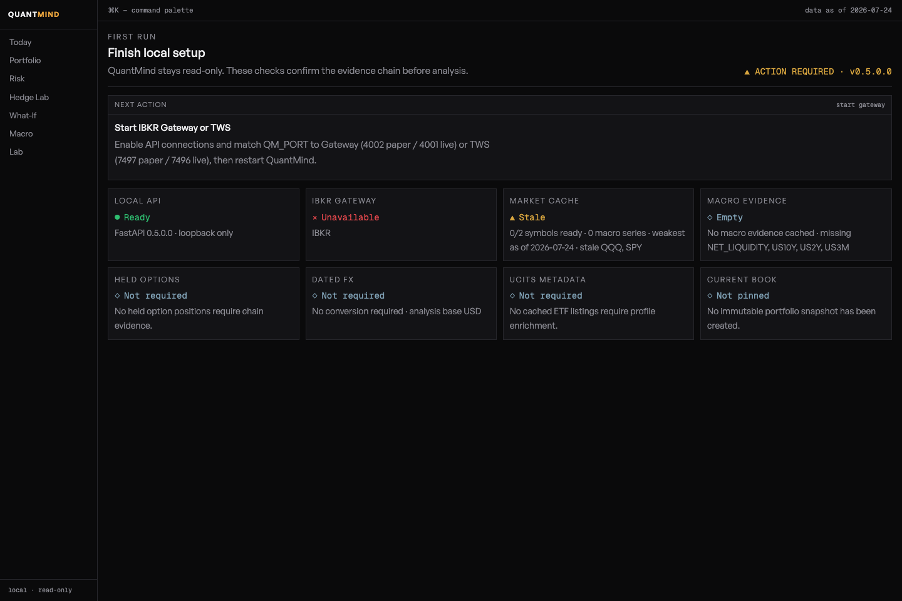
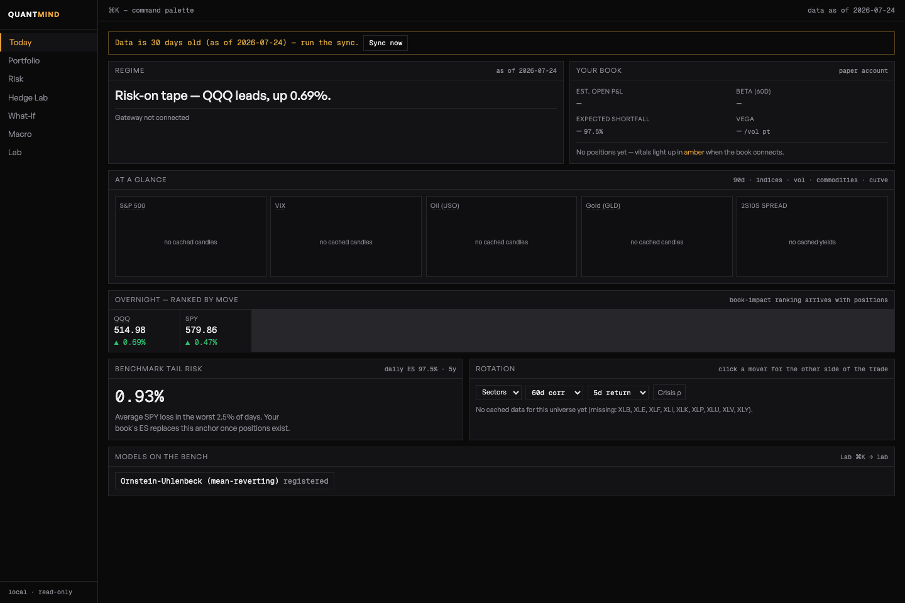
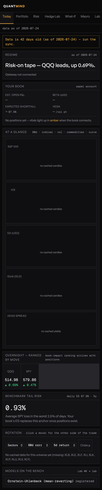
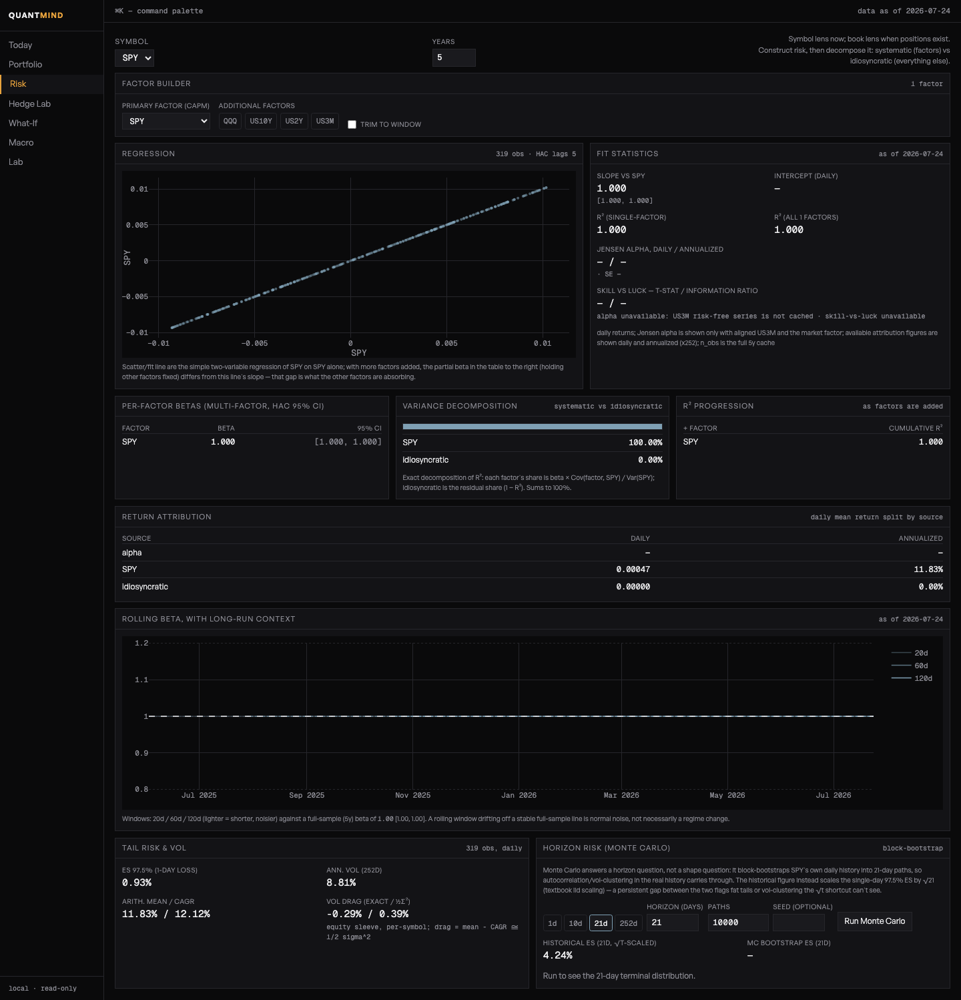
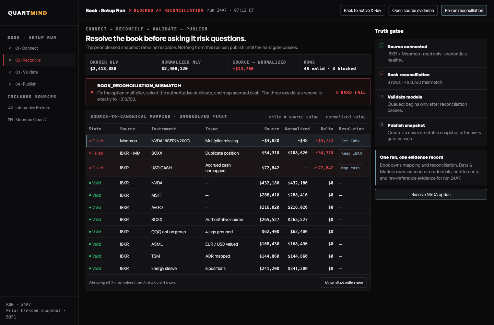
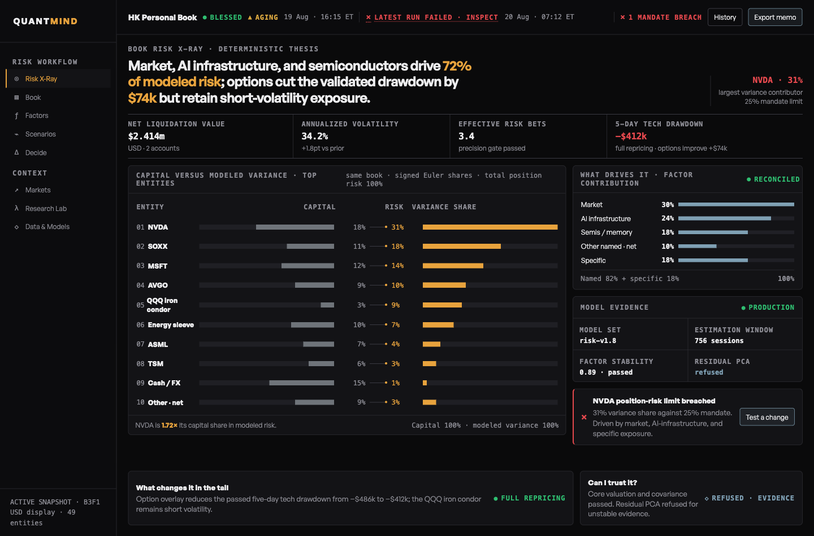
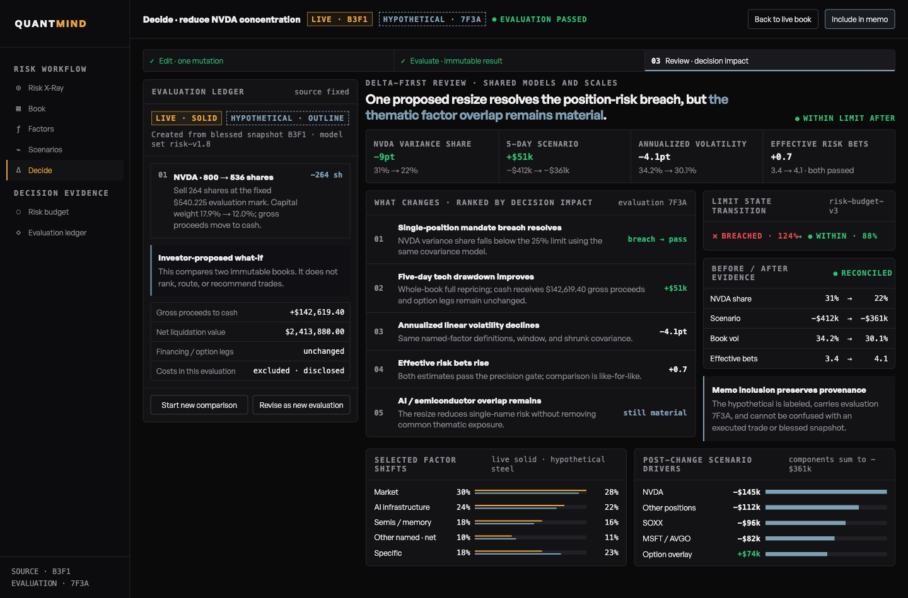
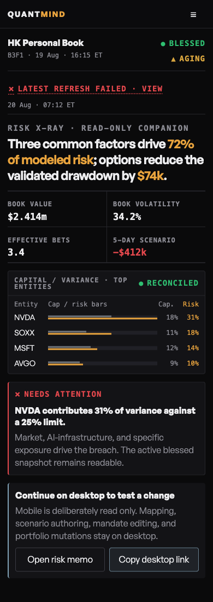

# QuantMind

**A local-first, options-aware portfolio risk workbench for investors who want to understand the book they actually own.**

QuantMind brings positions, factor exposure, scenario analysis, expected shortfall, options Greeks, and hedge exploration into one auditable workspace. It is designed for a concentrated, discretionary investor with a long-beta core and an options overlay, not for generic charting or trade execution.

> [!WARNING]
> QuantMind is pre-1.0 research software. It is read-only, does not submit orders, and is not investment advice. Verify all inputs, model assumptions, and outputs independently before making an investment decision.

## Start here: the QuantMind mental model

QuantMind has two kinds of truth and one deliberate boundary:

```text
IBKR + permitted public sources
          │
          ▼
  1. SYNC THE EVIDENCE CACHE     prices, contract identity, FX, macro, ETF facts
          │
          ▼
  2. PIN THE CURRENT BOOK        immutable positions + broker/account provenance
          │
          ▼
  3. ANALYSE ONE BOOK REFERENCE  portfolio → risk → what-if → hedge
          │
          ▼
     human decision only         QuantMind never submits an order
```

**Sync** and **Pin** are different operations. Sync refreshes the evidence used by the models. Pin creates an immutable record of the positions to which the analysis refers. Every decision screen should therefore be read as: “this result was computed for book `book_ref`, using evidence available as of this time.”

Five terms appear throughout the product:

| Term | Plain-English meaning |
| --- | --- |
| **Book** | The selected account's stocks, ETFs, and equity options at one point in time |
| **Pinned book / `book_ref`** | An immutable ID for that book; it prevents a refresh from silently changing the portfolio underneath an analysis |
| **Evidence cache** | Local market, macro, FX, contract, and fund-reference data used by the calculations |
| **As of** | The observation date of the weakest required input, not merely the newest file written |
| **Ready / attention / blocked** | Whether QuantMind has enough trustworthy evidence to calculate; amber and red are data-quality states, not trading signals |

If the interface seems empty, begin at `/book/setup`. Do not begin in Risk or Hedge Lab and try to infer what is missing.

## Your first useful session

The goal of the first session is not to generate a trade. It is to prove that QuantMind is analysing the intended account, listings, currencies, and option contracts.

1. **Choose the reporting boundary.** Set one `QM_ACCOUNT_ID` and a `QM_BASE_CURRENCY` in `.env`. A family-office or advisor login must select one account; QuantMind refuses to blend visible accounts.
2. **Connect the evidence sources.** Start IB Gateway/TWS in read-only mode, start QuantMind, and open `/book/setup`.
3. **Follow exactly one next action.** Setup will ask for market sync, held-option sync, FX sync, or a new book pin. Resolve amber/red cards instead of skipping past them.
4. **Reconcile Portfolio against IBKR.** Check symbols, contract IDs, currencies, quantities, option strikes/expiries/multipliers, and total value. Stop if the rows do not match the broker.
5. **Open Risk.** Start with the benchmark as the primary factor. Add only factors for which you have an economic thesis, then compare beta, R², variance contribution, return attribution, and tail loss.
6. **Test a decision.** Use What-If to clone the pinned equity book and change weights, or Hedge Lab to rank a small candidate set against a target beta. These are comparisons, not recommendations or orders.
7. **Return to Setup after the portfolio changes.** Sync evidence if needed, pin a new book, and keep the older `book_ref` as the audit trail for the earlier analysis.

The detailed installation and broker acceptance checklist lives in the [first-user runbook](docs/FIRST_USER_RUNBOOK.md).

Setup is the control plane for that sequence. Read the **Next action** first, then use the evidence cards to understand why the book is ready, needs attention, or is blocked. The synthetic example below is deliberately blocked: the API is healthy, but IBKR is unavailable, market and macro evidence are incomplete, and no book has been pinned.



## Screen-by-screen guide

| Screen | The question it answers | What you should do there |
| --- | --- | --- |
| **Setup** | “Can I trust the inputs for this book?” | Connect one IBKR account, sync required evidence, resolve stale/missing states, and pin the current book |
| **Today** | “What changed around my book?” | Scan market regime, overnight moves, curve/volatility context, rotation, and headline book risk before deeper analysis |
| **Portfolio** | “What do I actually own and where is the exposure?” | Reconcile the ledger, inspect local/base values, delta-adjusted exposure, option sleeve, expiry buckets, and core-vs-overlay P&L |
| **Risk** | “Which common drivers explain the return and risk?” | Choose a symbol/book lens, select factors, inspect beta and uncertainty, decompose explained vs specific variance, and calculate tail risk |
| **What-If** | “How would a proposed equity-weight change alter risk?” | Clone the pinned book, edit weights, recompute, compare book-vs-benchmark risk, and save a named local scenario |
| **Hedge Lab** | “Which allowed instrument best moves beta toward my target?” | Set a target, constrain candidates, run the ranking, and inspect notional, residual beta, carry, and resilience |
| **Macro** | “What regime variables surround the portfolio?” | Review yields, curve, liquidity, sectors, and factor context using dated source evidence |
| **Lab** | “Does a research model fit this series well enough to inspect?” | Select data, fit a registered model, examine parameter uncertainty, simulate, then compare its output with the book |

### What to read on Today

The top banner is operational: it tells you when the evidence cache is stale and provides the sync action. “Your book” remains blank until a valid current book is available. “At a glance” is market context; it is not a substitute for Portfolio or Risk. “Benchmark tail risk” is an anchor until a complete portfolio-level estimate can be calculated.

*Current-release screenshots below use QuantMind's deterministic synthetic E2E dataset. They never contain a real account or portfolio.*



The same workflow remains readable on a phone, but QuantMind deliberately hides analysis-authoring and book-mutation controls below `768 × 600`. Mobile is a read-only companion for checking state and results; use a tablet, laptop, or wider monitor to sync, pin, fit, or edit a scenario.



### How to read the Risk screen

Risk is a decomposition page, not a single score:

- **Beta / slope** estimates sensitivity to the selected primary factor. A beta of `1.3` means the series historically moved about 1.3% for a 1% factor move over the fitted sample; it is not a forecast.
- **R²** is the share of historical return variation explained by the selected factor set. High R² means the factor model describes more of the history, not that the investment is safer.
- **Per-factor beta with HAC confidence intervals** shows estimate uncertainty while allowing for heteroskedasticity and autocorrelation.
- **Variance decomposition** separates named systematic drivers from the residual, instrument-specific share. Factor shares can be signed in correlated multi-factor models; read them with the displayed reconciliation evidence.
- **Return attribution** separates average historical return associated with alpha, named factors, and the residual.
- **Expected shortfall (ES 97.5%)** is the average loss in the worst 2.5% of observed daily outcomes. It is a tail-loss summary, not a maximum possible loss.
- **Monte Carlo horizon risk** block-bootstraps historical returns into multi-day paths. It answers a horizon question and inherits the limits of the historical sample.

Start with one factor. Add a second factor only when it answers a distinct question, then watch the R² progression and whether coefficients remain stable. Throwing many correlated ETFs into the regression produces an impressive-looking but hard-to-interpret model.

Jensen alpha is shown only when the cached risk-free series matches the reporting currency. v0.5 includes USD `US3M` evidence; an EUR, GBP, or other non-USD analysis therefore withholds alpha instead of silently subtracting a USD cash rate.



### Portfolio valuation and FX

The Portfolio ledger keeps local and reporting-currency values distinct. For example, a London listing may be quoted in pence by a vendor, normalized to GBP at ingestion, and then converted to an EUR reporting book using dated ECB evidence. QuantMind retains the original quote convention and conversion evidence.

- `local_*` values describe the listing or broker currency.
- `*_base` values describe `QM_BASE_CURRENCY`.
- A dash means the number was intentionally withheld, not zero.
- If one position cannot be priced or converted, QuantMind labels the available subtotal and withholds totals or weights that would imply completeness.
- Foreign-position unrealized P&L remains local-currency-only in v0.5 because current FX is not evidence of the acquisition-date cost rate.

### What-If versus Hedge Lab

Use **What-If** when you already have a proposed change and want a before/after comparison. Use **Hedge Lab** when you have a target beta and want a ranked list of candidate instruments. Both operate on a pinned book and cached evidence. Neither routes a trade.

An explicitly requested hedge candidate is part of the analytical question: if its currency, FX evidence, or cached history is missing, Hedge Lab returns a named `422` instead of quietly changing the requested universe. When QuantMind chooses the default candidate universe, any omitted candidates and reasons are returned as `skipped_candidates`.

In this alpha, What-If and Hedge Lab are equity-book tools. They fail closed for option books or non-unit multipliers until contract-aware repricing is implemented. Options remain visible in Portfolio and the option-risk surfaces; they are never flattened into ordinary shares just to make a scenario run.

## Three practical workflows

### Concentrated technology book

1. Reconcile the largest positions and option multipliers in Portfolio.
2. Inspect delta-adjusted underlier exposure so stock and option legs are viewed together.
3. In Risk, use the broad benchmark first, then add a technology/semiconductor factor and rates only when the exposure thesis calls for them.
4. Compare capital concentration with beta and variance contribution. A 10% capital weight can represent far more than 10% of modeled risk.
5. Test a resize in What-If or a beta target in Hedge Lab; compare the resulting tail loss and factor exposure before making any broker-side decision.

### European and UCITS portfolio

1. Set `QM_BASE_CURRENCY` to the currency in which you manage the book, such as `EUR` or `GBP`.
2. Let IBKR provide listing identity and currency for held instruments. Use explicit yfinance symbols only as a fallback, for example `LGEN.L`.
3. Enable `QM_UCITS_METADATA_ENABLED=true` only if you accept justETF enrichment. QuantMind keys fund facts by checksum-valid ISIN and caches them locally for 30 days.
4. Re-run Setup sync after adding a new currency or ETF. Confirm FX and UCITS cards before pinning the next book.
5. Treat fund profile data and price data as separate provenance chains. A fresh price does not make stale fund facts fresh.

### Long equity plus option overlay

1. Pin the book only after exact held contracts have been identified.
2. Confirm option right, strike, expiry, multiplier, quote freshness, and pricing coverage in Portfolio.
3. Read delta-adjusted underlier exposure alongside the option sleeve and expiry buckets.
4. Treat cross-currency aggregate monetary Greeks as unavailable when QuantMind says so. Do not manually add unlike currencies.
5. Use broker tools for execution; refresh and pin a new QuantMind book after the overlay changes.

## Status and evidence rules

| UI state | Meaning | Operator response |
| --- | --- | --- |
| **Ready / green** | All required evidence for that surface passed freshness and identity checks | Continue, while still verifying model assumptions |
| **Attention / amber** | A recoverable input is stale, partial, or optional-source work failed | Read the named warning, run the offered sync, and verify the new as-of time |
| **Blocked / red** | QuantMind cannot make the calculation without fabricating, mixing, or mis-scoping data | Resolve the named account, currency, contract, book, or unsupported-instrument issue |
| **Unavailable / dash** | The value is intentionally not calculated from current evidence | Do not interpret it as zero and do not fill it manually without recording provenance |

## A normal operating rhythm

- **Before analysis:** start IBKR, open Setup, refresh stale evidence, then pin the book you intend to discuss.
- **During analysis:** keep the `book_ref` fixed while moving between Portfolio, Risk, What-If, and Hedge Lab.
- **After a broker-side change:** sync changed instruments and pin a new book rather than overwriting the old analytical state.
- **When sharing output:** include the book reference, reporting currency, as-of date, selected factors, horizon, and any incomplete-evidence warning.
- **When a result looks surprising:** inspect source provenance and contract identity before changing the model.

## Why QuantMind

Most market tools know the market. QuantMind is intended to know your book:

- Pin an immutable representation of the current book before running a What-If or hedge calculation.
- Separate systematic factor exposure from idiosyncratic risk with regression, beta, variance decomposition, and return attribution.
- Treat equity positions and option overlays as one analytical problem, with Greeks, option-chain storage, scenario stress, and Monte Carlo tools.
- Keep the evidence local and explicit: as-of times, data freshness, book references, failure states, and source boundaries are visible rather than silently filled in.
- Work from an IBKR-connected cache when available, while keeping a deterministic synthetic mode for development and demos.

QuantMind does not try to replace TradingView, Koyfin, or an execution platform. It supplies the book-aware risk layer those products cannot provide.

## What is included today

| Area | Current capability |
| --- | --- |
| Book truth | Canonical book contract, immutable snapshots, provenance manifests, corruption detection, and explicit `book_ref` pinning |
| Factor risk | Base-currency CAPM and multi-factor regression, rolling beta, alpha only when risk-free evidence exists, variance decomposition, and attribution |
| Risk | Historical expected shortfall, annualised volatility, horizon Monte Carlo, drawdown context, and scenario tooling |
| Options | Read-only IBKR chain ingestion for bounded surfaces plus exact held contracts, stored bid/ask marks, book Greeks, and option-aware risk boundaries |
| Decisions | What-If analysis, hedge candidate ranking/sizing, leverage checks, and saved local scenarios |
| Market context | Regime, macro, rotation, instruments, news adapters, and a research-model lab |
| Data | IBKR-first daily bars and contract identity, ECB dated FX, opt-in ISIN-addressed UCITS profiles, explicit yfinance fallback, FRED macro data, and a local Parquet/DuckDB cache |
| Product | Guided first-run readiness, FastAPI API, React 19 web client, generated OpenAPI types, and a dark professional alpha workbench |

The current release is a single-book alpha. Multi-book onboarding, issuer-specific UCITS holdings ingestion, wider vendor ingestion, production broker jobs, and the full SaaS layer are intentionally future work.

## Architecture

```text
IBKR Gateway / permitted public sources
                 │
                 ▼
      sync CLIs and source adapters
                 │
                 ▼
  local Parquet + DuckDB evidence cache
                 │
                 ▼
Python risk, factor, options, and hedge core
                 │
                 ▼
         FastAPI contract + OpenAPI
                 │
                 ▼
    React workbench / local browser UI
```

The analytical core is deliberately separated from I/O. `risk/`, `analytics/`, and `hedge/` contain pure calculation code; broker, source, datastore, and API layers carry integration concerns.

## Quick start

For the first live portfolio, follow the complete [first-user runbook](docs/FIRST_USER_RUNBOOK.md). The short path is below.

### Prerequisites

- Python 3.12+
- [uv](https://docs.astral.sh/uv/)
- [Bun](https://bun.sh/)
- Optional: IBKR Gateway or TWS for live read-only data and portfolio access

### Run the local workbench

```bash
git clone https://github.com/ionutnodis/quant-mind.git
cd quant-mind

cp .env.example .env
uv sync --locked --dev
cd web && bun install --frozen-lockfile && bun run build && cd ..

# Start IBKR Gateway or TWS first, then start the local workbench.
uv run python -m quantmind.api.main
```

Open `http://127.0.0.1:8000/book/setup` (`/setup` remains a first-use alias). The Setup screen diagnoses the local API, the selected IBKR account, daily-bar freshness, and the current pinned book. It can run the market sync and pin the current live book without submitting orders.

### Explore without connecting a brokerage account

Use the isolated synthetic environment to learn the navigation and model surfaces before pointing QuantMind at IBKR. It writes only to a temporary generated dataset and cannot submit orders.

Terminal 1, from the repository root:

```bash
uv run python -m quantmind.testing.synthetic_e2e --port 8765
```

Terminal 2:

```bash
cd web
QM_API_PROXY_TARGET=http://127.0.0.1:8765 bun run dev -- --port 4173
```

Open `http://127.0.0.1:4173`. The synthetic environment is deliberately deterministic, so it is suitable for orientation, screenshots, UI development, and regression testing. It is not suitable for validating broker connectivity.

For frontend development, run Vite in a second terminal:

```bash
cd web
bun run dev
```

Open the Vite URL, normally `http://127.0.0.1:5173`. Vite proxies `/api` to the local API, so the browser does not need direct broker access.

### Populate data

With IBKR Gateway running, sync the starter universe, the selected account's stock and option underliers, held-option chains, and macro series:

```bash
uv run python -m quantmind.sync_cli
```

To sync a smaller set of daily bars:

```bash
uv run python -m quantmind.sync_cli SPY QQQ TLT
```

Option-chain sync can also be run explicitly. It reads cached spot data and snapshots monthly options up to 90 days out, within ±15% of spot:

```bash
uv run python -m quantmind.options_sync_cli SPY QQQ
```

If a broker is unavailable, the application starts in a degraded but honest state: unavailable live data is surfaced as unavailable rather than invented.

### Resolve identity and stale-cache blocks

The `symbol_map`, stored as `$QM_DATA_DIR/symbols.json`, deliberately maps each display symbol to one canonical IBKR contract ID (`conId`). This alpha cannot represent two listings that IBKR reports under the same ticker. Before sync, normalize a dual-listed same-ticker holding to one canonical listing/symbol; QuantMind blocks analysis rather than collapse two contracts into one position.

Do not hand-edit the cache to clear an identity warning. Run **Sync market data** in Setup or `uv run python -m quantmind.sync_cli` to rebuild stale or mismatched instrument metadata. Re-run `uv run python -m quantmind.options_sync_cli UNDERLIER` for a stale or mismatched option chain. If an existing `book_ref` then reports that instrument identity changed, pin a new book before analysis.

## Configuration

Runtime configuration is loaded from `.env` with the `QM_` prefix. Common settings:

```dotenv
# IBKR Gateway is paper-trading port 4002 by default; live is commonly 4001.
QM_HOST=127.0.0.1
QM_PORT=4002
QM_CLIENT_ID=17
QM_ACCOUNT_ID=

# Local data cache and benchmark
QM_DATA_DIR=data
QM_BENCHMARK=SPY
QM_BASE_CURRENCY=USD
# Optional when the production frontend is built outside ./web/dist
# QM_WEB_DIST=/absolute/path/to/web/dist

# Opt-in free fallback. IBKR remains authoritative for symbols it supplies.
QM_YFINANCE_SYMBOLS=LGEN.L

# Optional UCITS profile enrichment. Disabled until explicitly accepted.
QM_UCITS_METADATA_ENABLED=false

# Optional local API protection
QM_API_TOKEN=
QM_API_ALLOWED_ORIGINS=http://127.0.0.1:8000,http://localhost:8000,http://127.0.0.1:5173,http://localhost:5173
```

Do not commit `.env`, API keys, brokerage credentials, account numbers, or private portfolio data.

## Development and verification

```bash
# Python suite
uv run pytest

# Web suite, build, and browser smoke test
cd web
bun run lint
bunx vitest run
bun run build
bunx playwright test
```

The browser suite starts an isolated synthetic FastAPI cache. It is safe to use in CI and does not read a developer's local holdings.

When changing an API contract, regenerate both committed API artifacts:

```bash
uv run python scripts/dump_openapi.py
cd web
bun run gen:types
```

## Product boundaries

- **Read-only by design:** no order submission or broker execution surface.
- **Exactly one account:** `QM_ACCOUNT_ID` selects the portfolio. A multi-account IBKR session without an explicit selection fails closed rather than blending client books.
- **One contract per display symbol:** the current `symbol_map` stores one canonical `conId` for each symbol. Dual-listed positions that share a ticker must be normalized to one canonical listing/symbol before sync; the alpha has no in-app listing-reconciliation layer.
- **Advisor-safe reads:** selected-account portfolio updates avoid IBKR's global positions request, which is not available to advisor/master sessions with more than 50 subaccounts.
- **Local-first:** binds to loopback by default and keeps the evidence cache on the local machine.
- **Single provenance:** yfinance fallback is opt-in and never silently replaces IBKR data for the same symbol. A configured fallback symbol with an existing positive IBKR conId remains IBKR-owned and is skipped with a warning.
- **European quote units:** London `GBp`/`GBX` fallback bars are normalized from pence to GBP at ingestion, with the original unit and scale retained in metadata.
- **Failure isolation:** one unavailable symbol, index entitlement, metadata record, or external-data source produces an explicit partial sync without discarding successful independent cache phases.
- **Single writer:** browser-triggered, full-CLI, and option-chain syncs share a datastore-wide process lock, so two processes cannot publish competing cache generations.
- **Data honesty:** readiness uses the weakest required market/macro observation; stale books, incomplete option chains, unsupported contracts, and invalid numeric input are represented explicitly. If any position is unpriced, QuantMind withholds total value and portfolio weights and labels the priced subtotal.
- **Currency guard:** mixed-currency stock and ETF prices are converted into `QM_BASE_CURRENCY` with dated, provenance-backed ECB observations before portfolio and factor-return math. Cross-currency aggregate option Greeks remain withheld until every monetary Greek is converted leg by leg.
- **UCITS identity:** broker symbol/conId identifies the listing; ISIN identifies the ETF share class. Optional justETF enrichment is disabled by default, routed only for supported European fund-domicile prefixes, cached for 30 days, and shown separately from price provenance. The prefix gate is an ingestion heuristic, not a regulatory UCITS attestation.
- **Instrument guard:** the first-user acceptance book may contain stocks, ETFs, and equity options. Futures, futures options, bonds, CFDs, FX/cash rows, and other security types remain explicitly unsupported.
- **Responsive workflow:** one semantic UI scales from wide monitors through laptops and tablets to a read-only phone companion; authoring controls require at least 768 × 600 and dense analytical tables scroll inside their panels.

### Missing-FX behavior by endpoint

| Surface | Behavior when required dated FX is missing or stale |
| --- | --- |
| Portfolio | Returns `200` with local marks, `fx.status=incomplete`, partial valuation, and withheld total/weights where conversion is unavailable |
| Setup | Returns `needs_attention` and routes the user to `sync_fx_data` |
| Risk, What-If, Hedge, Leverage | Return a named `422` rather than calculate returns, factors, or sizing from unlike currencies |
| Options Greeks | Return a named `422` for non-base-currency books until monetary Greeks and stress P&L are normalized leg by leg |

The 0.5 API keeps broker-reported account fields in their original currency and adds explicit `*_base` fields for normalized account totals. Base-currency analytical responses share one nested `fx` evidence contract (`status`, `base_currency`, `source`, `as_of`, `fetched_at`, and missing currencies).

Pinned books keep their original reporting currency as part of their immutable identity. After changing `QM_BASE_CURRENCY`, mint a lineage-preserving successor before reusing an older analysis URL:

```bash
curl -X POST http://127.0.0.1:8000/api/book/OLD_BOOK_REF/rebase
```

The response returns a new `snapshot_id`, retains the original positions and valuation timestamp, and records `rebased_from`. The old snapshot remains unchanged.

## Approved product direction

The following images are **design-review mockups, not v0.5 product screenshots**. They document the approved direction for the next audience-facing iteration: reconciliation before publication, a book-level risk X-ray, immutable before/after decision review, and a read-only mobile companion. They are included so contributors can distinguish the intended product thesis from capabilities that already ship. Names, positions, and values shown in these mockups are illustrative and are not broker data.

### Reconcile before publishing a book



### Explain concentration as risk, not only capital weight



### Review a proposed change against the same evidence



### Keep phones useful without turning them into an execution surface



## Documentation

- [Design system and product decisions](DESIGN.md)
- [First-user installation and acceptance runbook](docs/FIRST_USER_RUNBOOK.md)
- [Contributor and engineering notes](CLAUDE.md)
- [Agent workflow routing](AGENTS.md)
- [Data-source boundaries and provenance](DATA_SOURCES.md)
- [Security policy](SECURITY.md)
- [Web-client setup and API type generation](web/README.md)
- [API contract](openapi.json)
- [Release notes](CHANGELOG.md)
- [Deferred work](TODOS.md)

## License and status

QuantMind is a public, pre-1.0 source repository. No open-source license has been granted yet; all rights are reserved unless the repository owner grants permission in writing. Public visibility alone does not grant permission to copy, modify, or redistribute the code.
